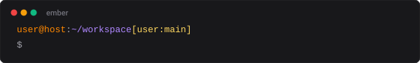
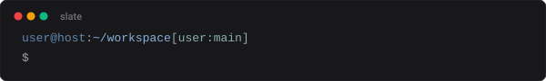
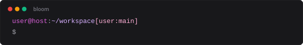
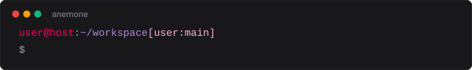
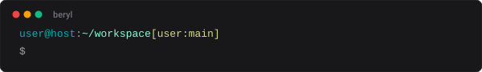
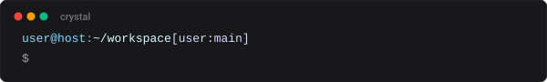
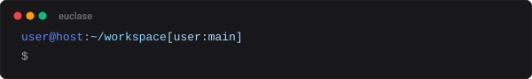
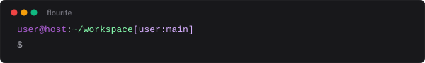

# Presets Gallery

A visual preview of all prompt presets available in `ps1`.

To apply any preset, run:
```bash
ps1 set <name>
```

---

## Quick Overview

| Name | Category | `user@host` | `path` | `git branch` | Description |
|---|---|---|---|---|---|
| [`minimal`](#minimal) | Standard | — | — | — | Path and prompt char only |
| [`simple`](#simple) | Standard | — | — | — | Standard `user@host:path` with no color |
| [`default`](#default) | Standard | `#22c55e` | `#06b6d4` | `#eab308` | Green / Cyan / Yellow standard theme |
| [`ember`](#ember) | Standard | `#ff8700` | `#af87ff` | `#ffd75f` | Orange / purple / gold color theme |
| [`slate`](#slate) | Standard | `#5f87af` | `#87afd7` | `#87afaf` | Blue-gray color theme |
| [`bloom`](#bloom) | Standard | `#d75fd7` | `#d7afff` | `#ffafd7` | Pink / lavender color theme |
| [`mellow`](#mellow) | Standard | `#afd7ff` | `#afffaf` | `#ffd7af` | Soft pastel blue / green / peach theme |
| [`anemone`](#anemone) | Floral | `#ff005f` | `#af87d7` | `#ffafd7` | Crimson red / violet purple / rose pink |
| [`bergamot`](#bergamot) | Floral | `#ffaf00` | `#afd75f` | `#ffd787` | Citrus orange / herbal lime / warm cream |
| [`clover`](#clover) | Floral | `#5faf5f` | `#afd7af` | `#ffd7d7` | Clover meadow green / sage mint / blossom pink |
| [`beryl`](#beryl) | Mineral | `#00afaf` | `#87ffd7` | `#d7d787` | Aquamarine teal / seafoam mint / golden beryl |
| [`crystal`](#crystal) | Mineral | `#87d7ff` | `#d7ffff` | `#d7d7ff` | Clear ice blue / sparkling cyan / prism lavender |
| [`diamond`](#diamond) | Mineral | `#e4e4e4` | `#5fd7ff` | `#afffff` | Brilliant silver-white / electric diamond blue |
| [`euclase`](#euclase) | Mineral | `#5f87ff` | `#87d7ff` | `#afd7ff` | Sapphire blue / cerulean sky / translucent ice |
| [`flourite`](#flourite) | Mineral | `#af5fd7` | `#87ffaf` | `#d7afff` | Fluorite violet / emerald mint / soft lilac |
| [`jasper`](#jasper) | Mineral | `#d75f5f` | `#d7af87` | `#afaf5f` | Terracotta red / desert ochre / olive moss |
| [`olivin`](#olivin) | Mineral | `#87af00` | `#afd75f` | `#d7ff87` | Deep olive / peridot green / golden chartreuse |

---

## Standard Presets

### `minimal`
Path and prompt char only on a single line.


```bash
ps1 set minimal
```

---

### `simple`
Standard `user@host:path` layout without color escapes.


```bash
ps1 set simple
```

---

### `default`
Default terminal ANSI colors.


| Element | ANSI | Hex | Color |
|---|---|---|---|
| `user@host` | `32` | `#22c55e` | Green |
| `path` | `36` | `#06b6d4` | Cyan |
| `git branch` | `33` | `#eab308` | Yellow |

```bash
ps1 set default
```

---

### `ember`
Warm embers, dusk lavender, and golden sparks.



| Element | ANSI 256 | Hex | Color |
|---|---|---|---|
| `user@host` | `208` | `#ff8700` | Warm Orange |
| `path` | `141` | `#af87ff` | Soft Purple |
| `git branch` | `221` | `#ffd75f` | Gold |

```bash
ps1 set ember
```

---

### `slate`
Cool slate stone and muted sage tones.



| Element | ANSI 256 | Hex | Color |
|---|---|---|---|
| `user@host` | `67` | `#5f87af` | Slate Blue |
| `path` | `110` | `#87afd7` | Light Sky Blue |
| `git branch` | `109` | `#87afaf` | Sage Gray-Blue |

```bash
ps1 set slate
```

---

### `bloom`
Floral pink and gentle lavender shades.



| Element | ANSI 256 | Hex | Color |
|---|---|---|---|
| `user@host` | `170` | `#d75fd7` | Magenta Pink |
| `path` | `183` | `#d7afff` | Soft Lavender |
| `git branch` | `218` | `#ffafd7` | Light Rose Pink |

```bash
ps1 set bloom
```

---

### `mellow`
Soft pastel blue, refreshing green, and light peach.


| Element | ANSI 256 | Hex | Color |
|---|---|---|---|
| `user@host` | `153` | `#afd7ff` | Light Sky Blue |
| `path` | `157` | `#afffaf` | Pale Mint Green |
| `git branch` | `223` | `#ffd7af` | Soft Peach |

```bash
ps1 set mellow
```

---

## 花系 (Floral Presets)

### `anemone`
Inspired by the bold crimson petals and deep violet heart of anemone flowers.



| Element | ANSI 256 | Hex | Color |
|---|---|---|---|
| `user@host` | `197` | `#ff005f` | Crimson Poppy Red |
| `path` | `140` | `#af87d7` | Violet Purple |
| `git branch` | `218` | `#ffafd7` | Blossom Rose |

```bash
ps1 set anemone
```

---

### `bergamot`
Inspired by citrus bergamot fruit and aromatic herbal leaves.


| Element | ANSI 256 | Hex | Color |
|---|---|---|---|
| `user@host` | `214` | `#ffaf00` | Citrus Orange-Gold |
| `path` | `149` | `#afd75f` | Fresh Herb Lime |
| `git branch` | `222` | `#ffd787` | Pale Cream Yellow |

```bash
ps1 set bergamot
```

---

### `clover`
Inspired by green clover fields and gentle white-pink clover blossoms.


| Element | ANSI 256 | Hex | Color |
|---|---|---|---|
| `user@host` | `71` | `#5faf5f` | Clover Meadow Green |
| `path` | `151` | `#afd7af` | Soft Sage Mint |
| `git branch` | `224` | `#ffd7d7` | Clover Blossom Pink |

```bash
ps1 set clover
```

---

## 鉱石系 (Mineral & Gemstone Presets)

### `beryl`
Inspired by the beryl gemstone family (aquamarine, emerald, heliodor).



| Element | ANSI 256 | Hex | Color |
|---|---|---|---|
| `user@host` | `37` | `#00afaf` | Aquamarine Teal |
| `path` | `122` | `#87ffd7` | Seafoam Mint |
| `git branch` | `186` | `#d7d787` | Golden Beryl |

```bash
ps1 set beryl
```

---

### `crystal`
Inspired by pure quartz crystals and sparkling light refraction.



| Element | ANSI 256 | Hex | Color |
|---|---|---|---|
| `user@host` | `117` | `#87d7ff` | Clear Ice Blue |
| `path` | `195` | `#d7ffff` | Sparkling Cyan |
| `git branch` | `189` | `#d7d7ff` | Prism Lavender-Silver |

```bash
ps1 set crystal
```

---

### `diamond`
Inspired by brilliant diamond luster and sharp light dispersion.


| Element | ANSI 256 | Hex | Color |
|---|---|---|---|
| `user@host` | `254` | `#e4e4e4` | Brilliant Silver-White |
| `path` | `81` | `#5fd7ff` | Electric Diamond Blue |
| `git branch` | `159` | `#afffff` | Diamond Sparkle Blue |

```bash
ps1 set diamond
```

---

### `euclase`
Inspired by the rare, vivid blue-to-white gemstone euclase.



| Element | ANSI 256 | Hex | Color |
|---|---|---|---|
| `user@host` | `69` | `#5f87ff` | Sapphire Blue |
| `path` | `117` | `#87d7ff` | Cerulean Sky Blue |
| `git branch` | `153` | `#afd7ff` | Translucent Ice Blue |

```bash
ps1 set euclase
```

---

### `flourite`
Inspired by multicolored fluorite (蛍石) with purple, lilac, and emerald green zoning.



| Element | ANSI 256 | Hex | Color |
|---|---|---|---|
| `user@host` | `134` | `#af5fd7` | Fluorite Violet |
| `path` | `121` | `#87ffaf` | Translucent Emerald Mint |
| `git branch` | `183` | `#d7afff` | Soft Lilac |

```bash
ps1 set flourite
```

---

### `jasper`
Inspired by red jasper stone and warm desert earth tones.


| Element | ANSI 256 | Hex | Color |
|---|---|---|---|
| `user@host` | `167` | `#d75f5f` | Terracotta Red |
| `path` | `180` | `#d7af87` | Sandy Desert Ochre |
| `git branch` | `143` | `#afaf5f` | Olive Earth Moss |

```bash
ps1 set jasper
```

---

### `olivin`
Inspired by olivine (peridot) crystals and olive yellow-green tones.


| Element | ANSI 256 | Hex | Color |
|---|---|---|---|
| `user@host` | `106` | `#87af00` | Deep Olive Green |
| `path` | `149` | `#afd75f` | Bright Peridot Green |
| `git branch` | `192` | `#d7ff87` | Golden Chartreuse |

```bash
ps1 set olivin
```
